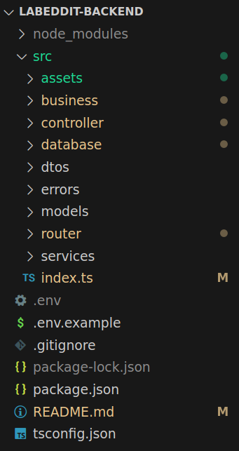
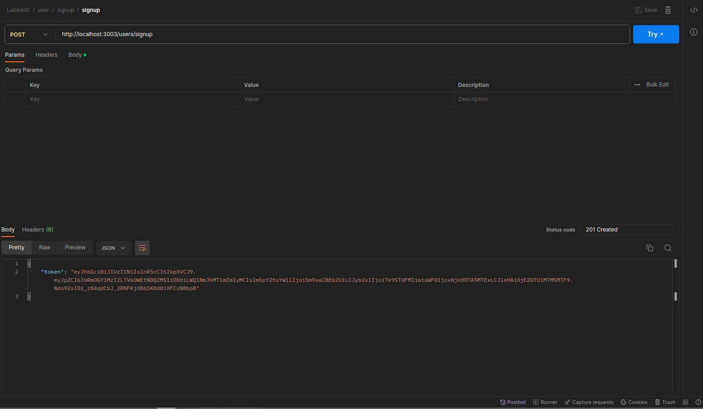
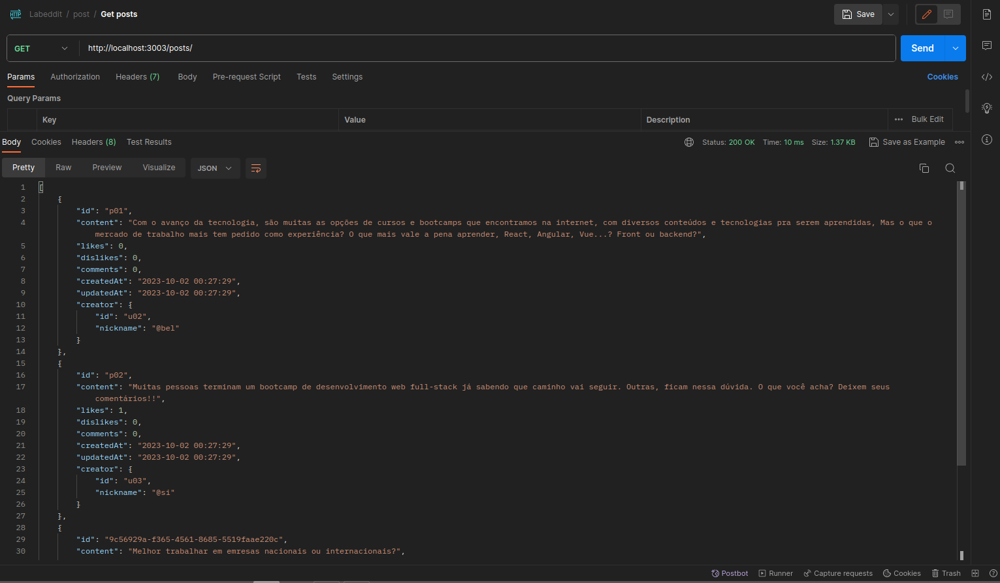
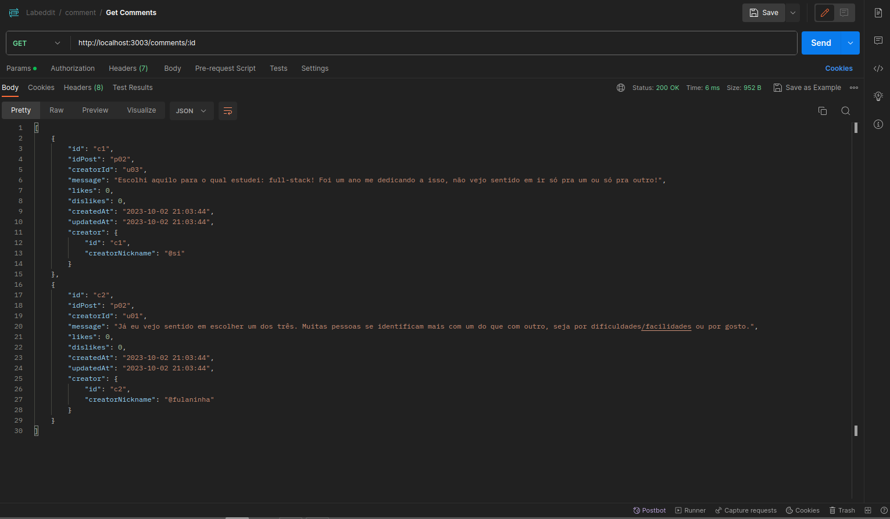

# Labeddit

Este é o repositório do backend da aplicação LabEddit. Trata-se de uma rede social no estilo Reddit, onde os usuários podem se cadastrar, postar textos, comentar posts de outros usuários, além de poder dar like e dislike nesses posts.
 

## Requisitos

- [Node.js](https://nodejs.org/) (v14 ou superior)
- [npm](https://www.npmjs.com/) ou [Yarn](https://yarnpkg.com/)
- [SQLite](https://www.sqlite.org/) (outra versão específica, se aplicável)

## Tecnologias utilizadas

- Node.js
- Express.js
- SQLite
- Knex
- TypeScript;
- Zod

Além dessas tecnologias, foram utilizados conceitos de arquitetura em camadas e programação orientada a objetos.

## Instalação

1. Clone o repositório:

   ```bash
   git clone https://github.com/carolcampos22/labeddit-backend.git
   ```

2. Acesse o diretório do projeto:
    ```bash
        cd labeddit-backend

    ```

3. Instale as dependências:

    ```bash
        #com npm:
        npm install

        #ou com Yarn:
        yarn install

    ```

4. Inicie o servidor:
    ```bash
        #com npm:
        npm run start

        #ou com yarn:
        yarn start
    ```
Agora, o servidor estará rodando em http://localhost:3000. Você pode utilizar o [Postman](https://www.postman.com/) ou outra ferramenta de sua preferência para testar os endpoints.

## Documentação da API
A documentação da API está disponível [aqui](https://documenter.getpostman.com/view/26570634/2s9YJgTLat).

## Estruturação das pastas do projeto



## Exemplos de algumas requisições

#### Signup
Endpoint para criação de um novo usuário


#### Get posts
Endpoint para visualização de todos os posts


#### Get comments
Endpoint para visualização dos comentários de um post, ao passar o ID desse post.


Todos os endpoints são protegidos, ou seja, é necessário um token para criação e visualização de posts e comentários. O token é gerado ao cadastrar um novo usuário (signup) ou fazer login no sistema.

## Pessoa desenvolvedora

#### Carolina Mendes - Web developer
[](https://www.linkedin.com/in/dev-carolina-mendes/)
